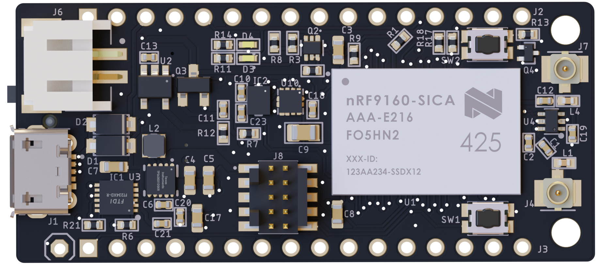
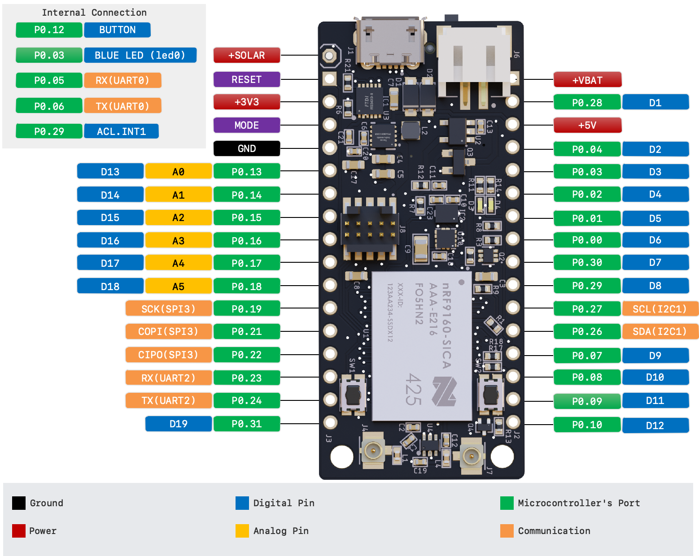
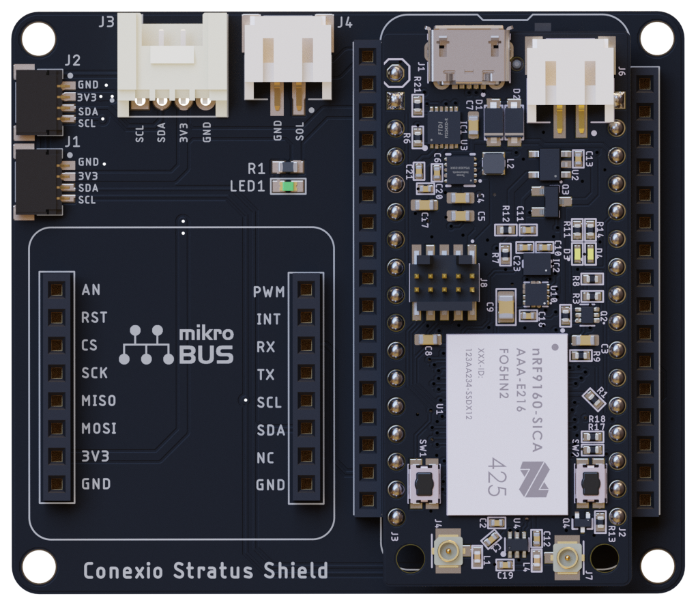

# conexio-stratus-board-schematics
Here you will find the schematic designs for the Conexio Stratus IoT dev kit and the shield.
A detailed description of the pin mapping can be found in stratus_pinouts.pdf.

## Conexio Stratus

**Conexio Stratus** is a tiny (50.8 mm x 22.86 mm) yet powerful development kit for creating cellular-connected electronic projects. It runs best-in-class Zephyr RTOS for connected devices and is a battery-operated platform, making it ideal for prototyping cellular IoT systems such as asset tracking applications, environmental monitoring, and smart meter monitoring just to name a few.
‌
Equipped with the Nordic nRF9160 System in Package (SiP), it supports LTE-M, NB-IoT, and Global Positioning System (GPS). Stratus has two onboard external U.FL antennas, one for the GPS and the other for LTE-M/NB-IoT, enabling it to support a global range of LTE bands.

## Built-In Battery Charging, Monitoring and Energy-Harvesting
‌Stratus has built-in battery charging, monitoring, and energy-harvesting circuitry which makes it easier to connect to and recharge the Li-Po battery, creating fully energy-autonomous applications. In addition, Stratus incorporates an accelerometer as well as a temperature & humidity sensor for detecting both movement and sensing the surrounding environment, right out of the box. Finally, Stratus provides 26 mixed-signal GPIOs for interfacing with external sensors, actuators, and other electronics.

## Pinouts

## Features & Specifications

**MCU**: Nordic nRF9160 Microcontroller with ARM Cortex M33
- 1 MB Flash
- 256 kB RAM
- ARM® TrustZone®
- ARM® Cryptocell 310
- Up to 4x SPI, I2C, and UART with Easy DMA
- I2S w/ EasyDMA
- 4x PWM with EasyDMA
- 12bit SADC with EasyDMA
- 2x RTC
- PPI (Programmable peripheral interconnect) interface

**Modem**
- Transceiver and baseband
- 3GPP LTE release 13 Category M1 and NB1 compliant
- 3GPP release 14 NB2 compliant
- GPS receiver (GPS L1 C/A supported) - Active antenna only.
- RF Transceiver for global coverage supporting bands:
- Cat-M1: B1, B2, B3, B4, B5, B8, B12, B13, B14, B17, B18, B19, B20, B25, B26, B28, B66
- Cat-NB1/NB2: B1, B2, B3, B4, B5, B8, B12, B13, B17, B18, B20, B25, B26, B28, B66
- Supports 4FF Nano SIM
- Pre-programmed MCUBoot bootloader

**Micro USB**
- For USB-to-Serial, DFU, and application firmware programming and debugging plus LiPo battery charging

**Energy harvester IC**
- AEM10941 solar energy harvester from E-peas Semiconductors
- Vin: 50 mV to 5 V
- Cold start: 3 μW @ 380 mV
- Power input: 3 μW to 550 mW
- Maximum power point tracking (MPPT)
- Supports battery types Li-ion and NiMH
- Max solar panels: up to 7 solar cells simultaneously

**Board power supply**
- 3.3 V Buck/Boost up to 0.9 A of current draw
- Operating range 2.8 to 5.5 V
- External LiPo battery connection (2 Pin JST type)
- Charge rate set to 300 mA with yellow LED indication
- Maximum output current: 800 mA
- Current consumption in low-power-mode: < 5 uA

**Debugger & Programmer**
- Supports J-Link and CMSIS-DAP based programmers
- 10-pin 0.05" (1.27 mm) pin connector

**User I/O**
- 32 Standard GPIOs (0.1" pitch)
- 26 user-programmable GPIOs
- 2 x push buttons (1 Reset, 1 General Purpose connected to P0.12)
- 1 x user-programmable Green LED connected to D7 (P0.03)

**Antenna connections**
- 1 x U.FL for LTE-M/NB-IoT with matching network
- 1 x U.FL for active GPS antenna

**Onboard sensors**
- Latest SHT4x temperature and humidity sensor from Sensirion
- ST Microelectronics LIS2DH MEMS digital output motion sensor: ultra-low-power high-performance 3-axis Femto accelerometer

**Power switch**
- SPDT slide switch for turning ON/OFF the power to the Stratus board

**Physical**
- 50.8 mm x 22.86 mm (2.0" x 0.9")
- Weight: ~5 grams.

## Conexio Stratus Shield

For expansion and interfacing various sensors and hardware peripherals via standard interfaces (I2C, SPI, & UART) with ease, Conexio Stratus also comes with a shield as an optional addon.

No need for breadboard and soldering iron, working with a Stratus shield requires no soldering and minimal wiring. Just plug the sensors, actuators, or displays into this shield via the standard cables, and focus on coding and application creation.

## Features & Specifications

- 1 x mikro BUS: add-on board standard from Mikroe, allowing connection to over 800+ click boards.
- 2 x Sparkfun Qwiic connector: SparkFun's Qwiic Connect System, allowing to connect over 100+ Qwiic products.
- 1 x Grove I2C connector: Grove is a modular, standardized connector prototyping system by Seeedstudio.
- 1 x 2 Pin JST connector for plugging the solar panel input.
- 1 x user-programmable LED
- 3.3 V operating voltage