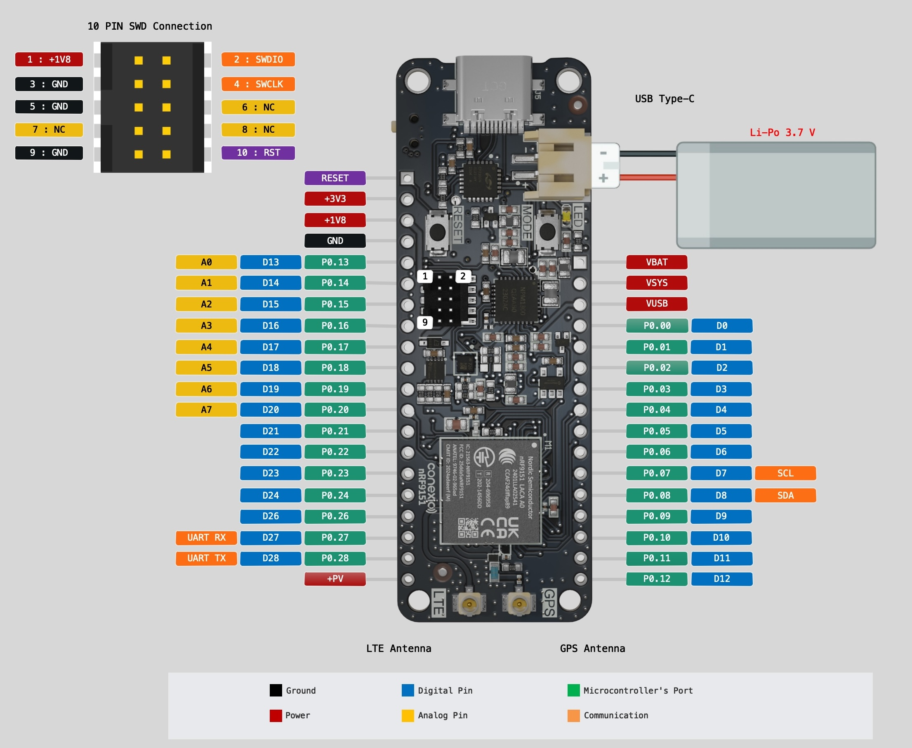

# Conexio Stratus Board Schematics
Here you will find the schematic designs for the Conexio Stratus IoT dev kit based on nRF91xx series and the associated shields and the expansion dock.
A detailed description of the pin mapping can be found in each specific board directory.

## Conexio Stratus Pro Series

**Conexio Stratus Pro** is a tiny-yet-powerful development kit for creating cellular-connected electronic projects and products. Powered by the cutting-edge nRF9161 cellular modem from Nordic Semiconductor, Stratus Pro offers unparalleled versatility, reliability, and ease of use, making it the go-to solution for IoT developers worldwide. It is a battery-operated platform, making it ideal for prototyping cellular IoT systems, such as asset tracking, environmental monitoring, smart metering, and even industrial automation.

With LTE-M, NB-IoT, and GPS connectivity packed into a compact form factor, Stratus Pro ensures your devices stay connected in any environment. It enables real-time data transmission and location tracking with minimal power consumption. Future-proof your IoT projects with DECT NR+ readiness, ensuring compatibility with emerging cellular standards for enhanced performance and longevity.

## Built-In Battery Charging, Monitoring and Energy-Harvesting

Thanks to the nPM1300 PMIC and fuel gauge, you can remotely monitor your Stratus Pro’s battery vitals and charging status. Stratus Pro also has built-in charging circuitry that makes it easier to connect to and recharge the Li-Po battery, creating fully energy-autonomous applications.

## Conexio Stratus Pro nRF9151 Pinouts

## Features & Specifications

**MCU**: Nordic nRF9151 Microcontroller 
- ARM Cortex-M33 with 1 MB Flash
- 256 kB RAM
- Pre-programmed MCUBoot bootloader

**Modem**
- Transceiver and baseband
- 3GPP LTE release 14 LTE-M/NB-IoT support
- DECT NR+ ready
- GPS/GNSS receiver
- RF Transceiver for global coverage supporting bands:
- B1, B2, B3, B4, B5, B8, B12, B13, B17, B18, B19, B20, B25, B26, B28, B65 (new), B66, and B85 (new)
- Supports 4FF Nano SIM, optional eSIM, or software SIM

**Included cellular Data**
- 500 MB of cellular data
- 250 SMS messages
- Valid for 10 years, can be reloaded or moved to a new plan
- Service available in 100+ countries (LTE + NB-IoT)

**Power Management IC: Nordic nPM1300**
- 800 mA battery charger
- Dual 200 mA buck DC/DC regulator
- Charging IC: Texas Instruments BQ25185
- Charge inputs: 3 V to 18 V
- Supports Li-ion, Li-Poly, and LiFePO4 battery chemistries

**External Storage**
- 16 KBit I2C EEPROM memory (24CW160T)

**Power**
- Operating range 1.8 to 5.5 V
- External LiPo battery connection (2 Pin JST type)
- Maximum output current: 800 mA
- Output voltages (via headers): 1.8 V, 3.3 V, 5 V (VUSB), VBAT
- SPDT slide switch for turning Stratus Pro on or off
- Quiescent current of entire board < 9 μA

**Onboard sensors**
- Battery fuel gauge enabled by nPM1300
- STMicroelectronics LIS2DH MEMS high-performance 3-axis accelerometer

**I/O**
- USB Type-C, for USB-to-Serial, DFU, and application firmware programming and debugging or battery charging
- 1 x U.FL for LTE-M/NB-IoT antenna
- 1 x U.FL for passive GPS antenna
- Total I/O pinouts: 36
- User I/O: Feather-compatible header, 28 programmable GPIO pins, 2 push buttons (1 reset, 1 programmable), 1 programmable LED
- QWIIC connector for external peripherals
- Supports J-Link and CMSIS-DAP-based programmers
- Onboard 10-pin 0.05 " (1.27 mm) mini SWD/JTAG pin connector

**Size**
- 66.04 mm x 25.40 mm

## Stratus Pro Expansion Dock

Start your product development with our Expansion Dock for Stratus Pro fast and easy. The Expansion Dock offers two QWIIC connectors, two Grove sockets, a mikroBUS™ socket, an nRF7002 Expansion board socket to add Wi-Fi location capabilities, and a SeeedStudio Xiao socket allowing you to create various wireless applications with one host board. It can't get any better than this., working with a Stratus shield requires no soldering and minimal wiring. Just plug the sensors, actuators, or displays into this shield via the standard cables, and focus on coding and application creation.

## Features & Specifications

- 2 x Stratus Pro nRF9151/nRF9161 header sockets.
- 1 x nRF7002EB socket.
- 1 x SeeedStudio Xiao socket.
- 1 x mikro BUS: add-on board standard from Mikroe, allowing connection to over 800+ click boards.
- 2 x Sparkfun Qwiic connector: SparkFun's Qwiic Connect System, allowing to connect over 100+ Qwiic products.
- 2 x Grove I2C connector: Grove is a modular, standardized connector prototyping system by Seeedstudio.
- 1 x 2 Pin JST connector for plugging the solar panel input.
- 1 x 2 Pin JST connector for plugging the lipo battery.
- 1 x Power switch

## Purchase

Conexio Stratus devices and accessories can be purchased directly from our [online store](https://conexiotech.com/shop/).

## Hardware Lineage and License

This board is released under the [CERN OHL-P (v2) license](https://opensource.org/license/cern-ohl-p). SeevLICENSEvfor more info.
